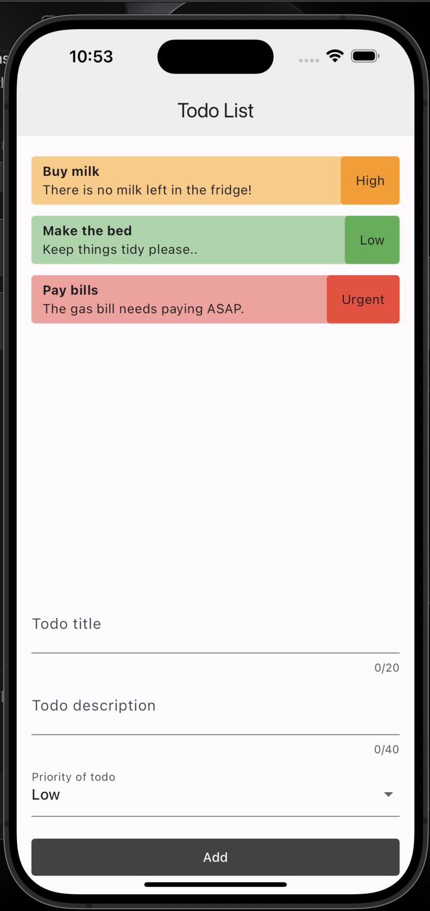

# Todo

The Flutter to-do list application allows users to manage tasks efficiently. Users can add tasks by entering a title, description, and selecting a priority level (e.g., low, medium, high, urgent). The app presents the tasks in a list format, and users can continue adding new tasks with a form that validates the inputs before submission. Each task is categorized by priority to help users prioritize their work.

## App Overview

